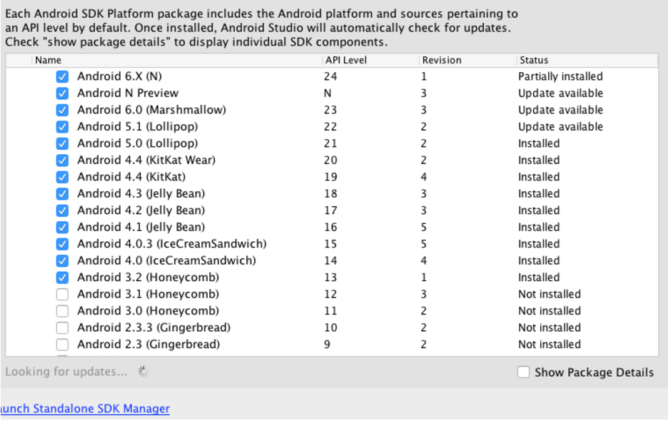
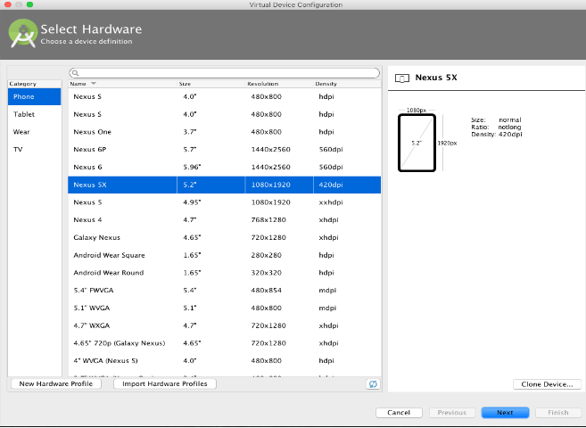
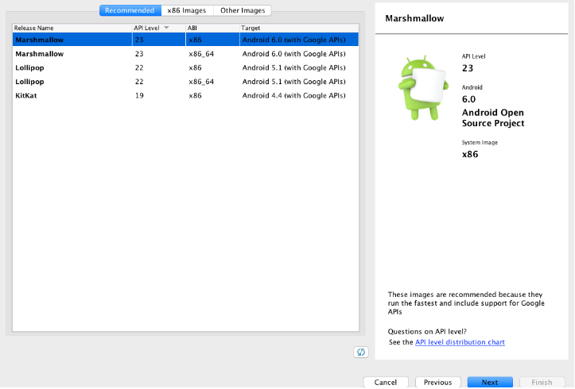
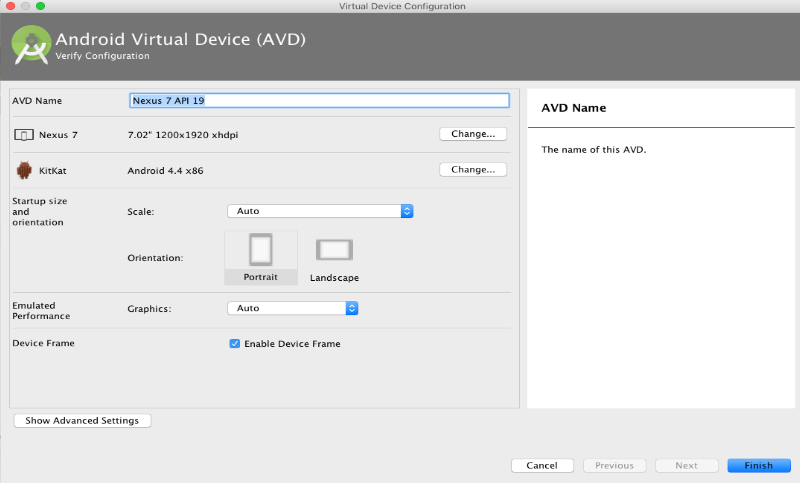

[Google Doc](https://docs.google.com/document/d/1JUePcj0W9mg6Ea__lakJK-Zd6ZFXchmqdbztLqIU4Cs/edit#heading=h.ieliyf4f8pjx)

#Android "Take It Home" Bell application development
## Objectives:
1.[Project Setup](#Project Setup)

2.[Understanding the flow of the android application](#Understanding the flow of the android application)

##Project Setup
To be able to debug / repackage / build on the android mobile application, you need to:

- download and install the most recent official IDE for android: [Android Studio](https://developer.android.com/studio/index.html) 

- Verify which version of the JDK you have: open a command line and type javac -version. If the JDK is not available or the version is lower than 1.8, download the [Java SE Development Kit 8](http://www.oracle.com/technetwork/java/javase/downloads/jdk8-downloads-2133151.html).

> MAC Users : There are, however, known stability issues in Android Studio on Mac when using JDK 1.8. Until these issues are resolved, you can improve stability by downgrading your JDK to an older version (but no lower than JDK 1.6).

- Launch Android Studio after installation.

- Select whether you want to import previous Android Studio settings, then click OK.

---

The Android Studio Setup Wizard guides you through the rest of the setup, which includes downloading Android SDK components that are required for development. 
 We only need SDK 4.4 and above. You can install as many SDK’s packages as you wish to. Not that, the packages are huge and therefore precaution must be taken with HDD available space in mind.

In a terminal / console of your choosing,navigate into the working directory of Android studio and git pull “Take me home“ repository. Using this address https://github.com/open-learning-exchange/Android-PBeLL.git
Run Android studio. Select New from the file menu and select import project.
Navigate to into the Android studio -> Android-PBeLL and select the settings.gradle file to import and open the project.

>@todo : 
>http://stackoverflow.com/questions/37397810/android-studio-unable-to-run-avd
>https://www.virtualbox.org/ticket/14294 NB Virtualbox version needs lower equal 4.3.28

- Click on the run button located at the top of your IDE. You will be prompted to Select Deployment Target. Select “Create New Emulator” button.

- Select a device definition from the list provided and click the next button
           

- Select system image from the list shown. API Level 22 and above works best. Preferably, choose 22 with Android 5.1. Click next to continue.
	

- Name the emulator and specify the necessary configuration as shown below. Click on finish to save the emulator. 
	

- You will be presented with the “Select Deployment Target” dialogue again . Choose the emulator we just created and click on the “OK” button.

- The emulator will be opened with application installed. You have successfully configured the development environment to get you started. 

<a name="Understanding the flow of the android application"><a/>
## Understanding the flow of the android application
WIP
